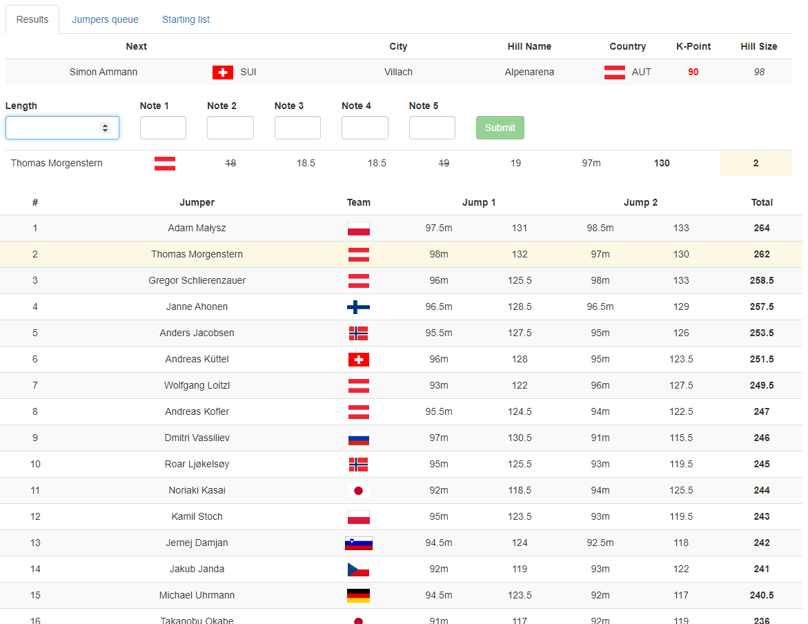

# Ski Jumping Contest

This application allows you to simulate ski jumping contest, with selection of jumpers and hill. Current data delivers jumpers from 2007/08 season and 2006/07 standings.
Application was written using Angular 8.

## How to use it
1. After starting development server, go to 'hills' tab on the header and select hill on which contest is held.
2. From 'jumpers' tab, select jumpers that will participate in contest. You can do it using team list, where jumpers are sorted by teams or using standings where they are sorted by their point total in standings.
3. Start contest with the button. Starting order will be sorted by total points of selected jumpers.
4. Use form to input the results of each jump. Application will take care of the rest.

## Development server

Run `ng serve` for a dev server. Navigate to `http://localhost:4200/`. The app will automatically reload if you change any of the source files.
